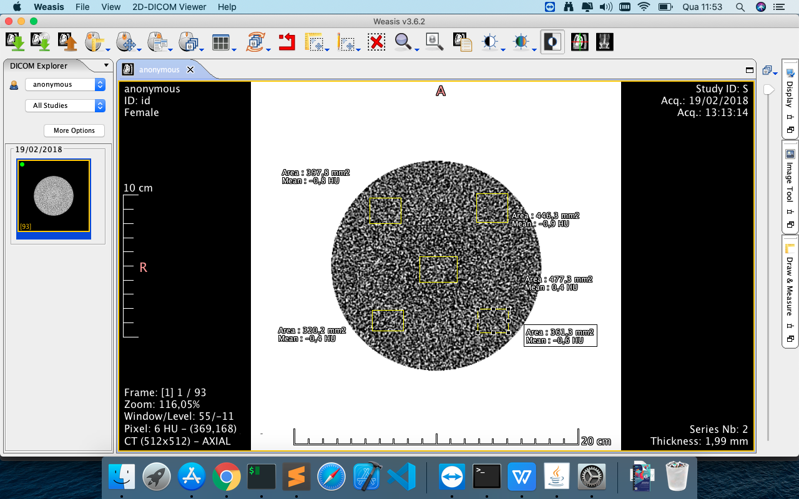

Você irá escrever uma classe que:

1 - Realiza a leitura das imagens DICOM (DICOM é um formato de imagem usado na medicina)

2 - Para cada imagem realizar 5 crops e calcular a média e desvio padrão dos Números de Housfield.

3 - Retornar um objeto json contendo uma identificação única da imagem e cada uma das regiões onde foi realizados os cálculo. 

**Observações:**

 

Para realizar a leitura dicom, você irá usar a biblioteca pydicom:

[https://pydicom.github.io/pydicom/stable/tutorials/installation.html](https://pydicom.github.io/pydicom/stable/tutorials/installation.html)

  

Exemplos de leitura do DICOM

[https://pydicom.github.io/pydicom/stable/auto_examples/input_output/plot_read_dicom.html](https://pydicom.github.io/pydicom/stable/auto_examples/input_output/plot_read_dicom.html)

  

Exemplos de Tags Dicom

[https://dicom.innolitics.com/ciods/ct-image](https://dicom.innolitics.com/ciods/ct-image)

  

  


> O crop será conforme ilustra a figura abaixo, para cada quadrado amarelo, você irá calcular a média dos numeros de hounsfield e o desvio padrão de cada região.




  

  

Ao final você ira retornar um objeto json da seguinte forma:

  
```javascript
   {
   "PatientID":{
      "IMG1":{
         "title":"imagem 1",
         "id":"ID IMAGEM 1",
         "regioes":{
            "superior_esquerda":{
               "media":"xxx",
               "std":"xxx"
            },
            "superior_direita":{
               "media":"xxx",
               "std":"xxx"
            },
            "centro":{
               "media":"xxx",
               "std":"xxx"
            },
            "inferior_esquerda":{
               "media":"xxx",
               "std":"xxx"
            },
            "inferior_direita":{
               "media":"xxx",
               "std":"xxx"
            }
         }
      },
      "...

...

..

..""IMG n":{
         "title":"imagem n",
         "id":"ID IMAGEM n",
         "regioes":{
            "superior_esquerda":{
               "media":"xxx",
               "std":"xxx"
            },
            "superior_direita":{
               "media":"xxx",
               "std":"xxx"
            },
            "centro":{
               "media":"xxx",
               "std":"xxx"
            },
            "inferior_esquerda":{
               "media":"xxx",
               "std":"xxx"
            },
            "inferior_direita":{
               "media":"xxx",
               "std":"xxx"
            }
         }
      }
   }
}


```
  

  
  